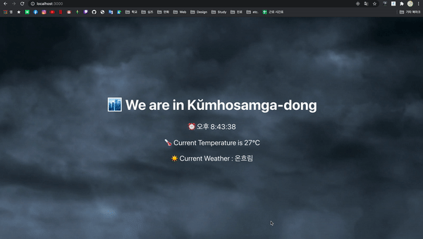
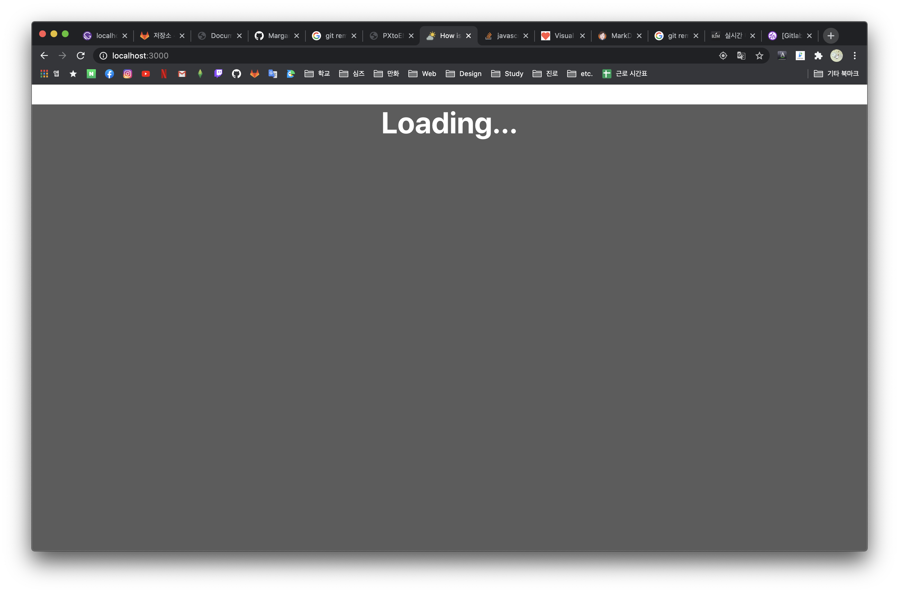

# 마가렛의 두번째 인큐베이팅 과제

**저번에 만든 날씨앱을 React로 만드는것이에요~_~**

바로 이렇게요..!!

### 과제 기능 수행 목록

1. 위치정보를 받아와서
2. 해당 위치정보의 날씨와 시간을 알려주면 됩니다

여러분들은 App.js와 App.css만 고치면 된답니다...!
뒷배경 영상들은 Public/weather_source에 저장해놓았습니다

### 요구사항

1. 시계가 초단위로 흘러가며 10분마다 날씨 정보를 요청하고 반영할것
2. react의 State를 적극적으로 이용할것
3. 위치정보를 받아올 때까지 화면은 로딩중이라는 화면이 떠야함 (이것도 State로 구현 가능)

### 권장사항

1. ES6 이상 문법을 준수하세요
2. React Hooks로 구현하세요

### 과제 기한

아무래도 리액트는 낯설기 때문에 8월 31일부터 매 회의마다 중간점검 들어가면서 DeadLine을 정해드릴겁니다~ 적극적인 회의 참여 부탁드려요ㅎㅎ